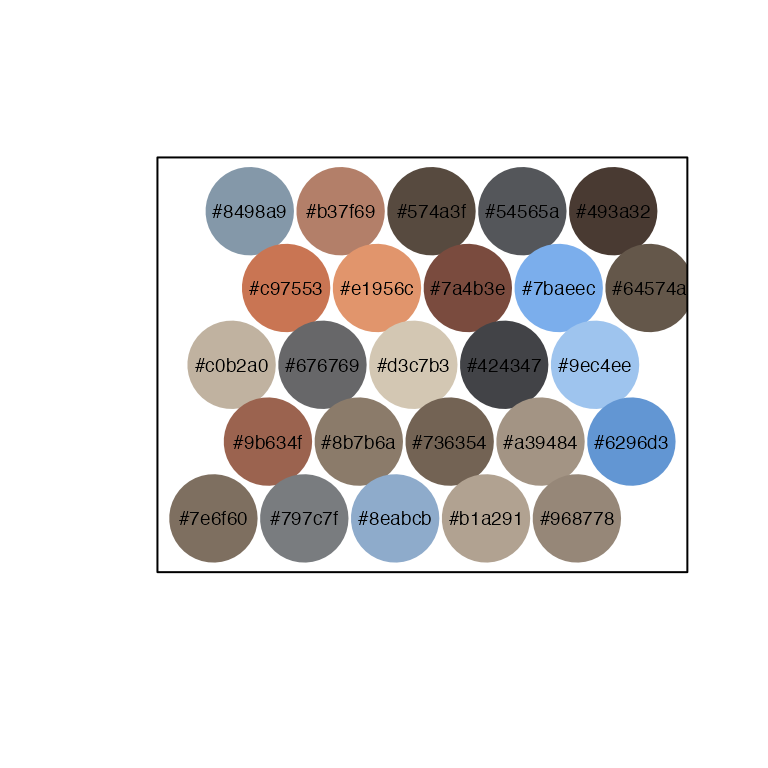
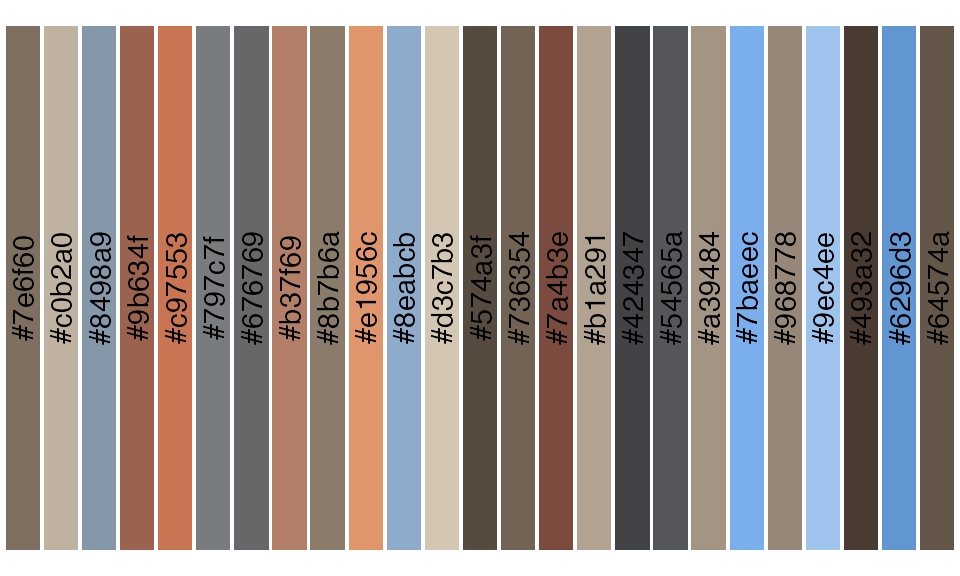
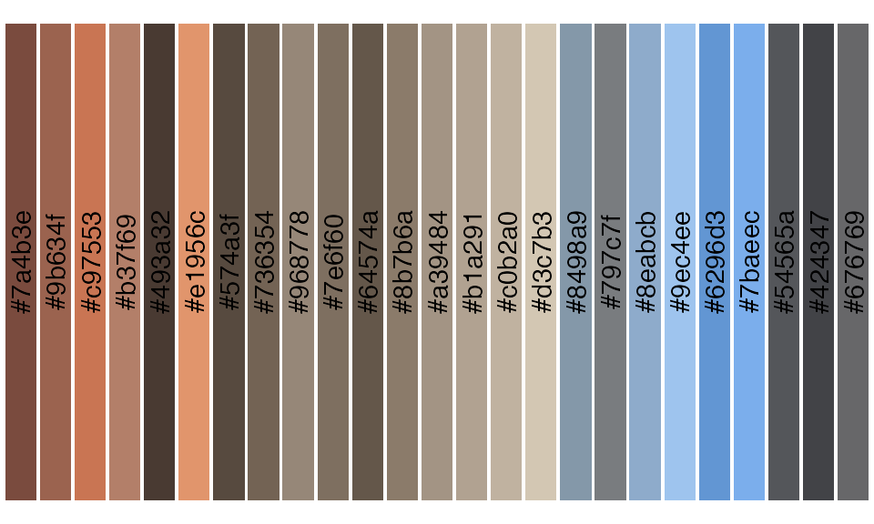
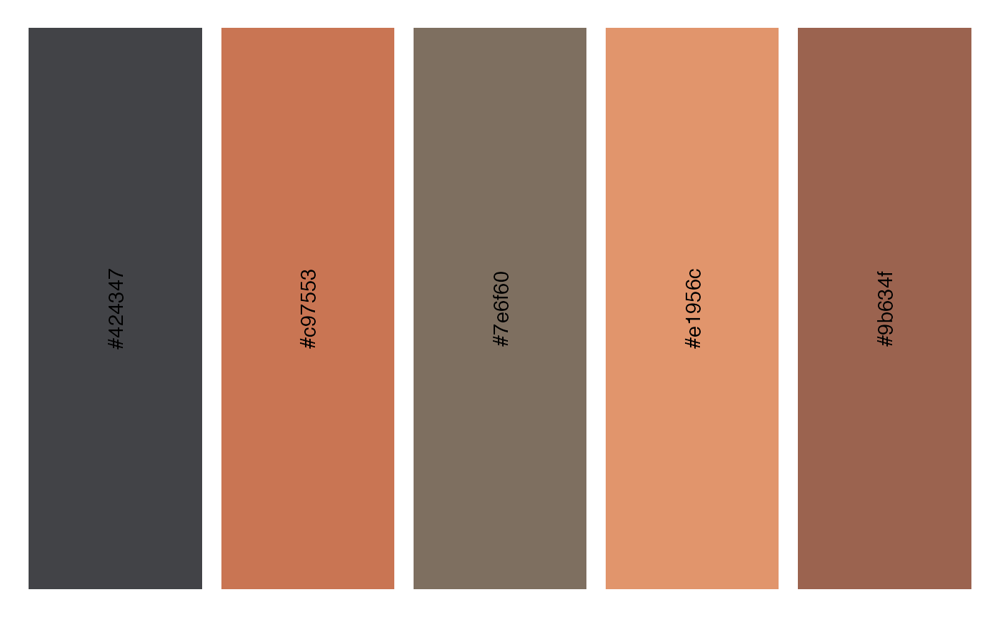
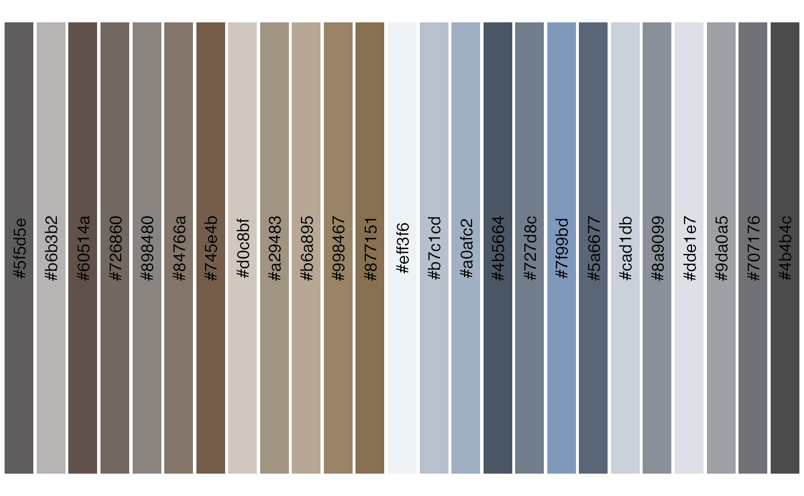

# lterpalettefinder Vignette

### Overview

The `lterpalettefinder` package (LTER + Palette + Finder) was initially
developed simply to house hexadecimal code color palettes manually
extracted from photos taken at Long Term Ecological Research sites.
During its development its purpose expanded to include a set of tools
for automatically extracting those colors and visualizing the derived
palettes.

This vignette describes the main functions of `lterpalettefinder` and
demonstrates one possible use of its workflow from the extraction of a
palette from a picture to the visualization of that palette.

``` r

library(lterpalettefinder)
```

### Start with a Picture


The `lterpalettefinder` workflow begins with a picture from which you’d
like to extract hexadecimal codes for the main colors (“main” is defined
later). This vignette will use this picture of a prescribed fire in Iowa
in 2018 (credit: Nick J Lyon) to allow for easy visual comparison
between the source photo and the palette returned by the functions
described below.

### Extracting the Palette

The primary function of this package is `platte_extract` which accepts
the name and/or path to the image file in your working directory. This
function also includes an optional progress bar that is switched off in
the example below

``` r

fire_palette <- palette_extract(image = "lyon_fire.png", progress_bar = FALSE)
```

The returned palette always contains the 25 most different colors (as
identified by k-means clustering on the red, green, blue bands extracted
from the image) stored as hexadecimal codes.

``` r

fire_palette
#>  [1] "#7e6f60" "#c0b2a0" "#8498a9" "#9b634f" "#c97553" "#797c7f" "#676769"
#>  [8] "#b37f69" "#8b7b6a" "#e1956c" "#8eabcb" "#d3c7b3" "#574a3f" "#736354"
#> [15] "#7a4b3e" "#b1a291" "#424347" "#54565a" "#a39484" "#7baeec" "#968778"
#> [22] "#9ec4ee" "#493a32" "#6296d3" "#64574a"
```

### Viewing the Palette

In our experience, few people can look at a string of hex codes and
instinctively interpret those as colors, so this package includes
`palette_demo` and `palette_ggdemo` to demonstrate the extracted
palettes. While there are some aesthetic differences between the plots
produced by the two functions the fundamental difference is that
`...demo` creates a base R plot while `...ggdemo` produces a `ggplot2`
plot. Additionally, `palette_demo` includes built in export options if
desired

``` r

palette_demo(palette = fire_palette, export = FALSE)
```



``` r

palette_ggdemo(palette = fire_palette)
```



### Organizing the Palette

You can also organize the colors into an order that approximates how
human eyes instinctively group colors using `palette_sort`. The sorting
isn’t perfect, but it is far easier to view similar colors than the
random order returned by `palette_extract`

``` r

fire_sort <- palette_sort(palette = fire_palette)
palette_ggdemo(palette = fire_sort)
```



If desired, `palette_extract` does include a `sort` argument (defaults
to “FALSE”) that can be activated. That said, it does take marginally
longer to compute (~0.5 seconds) the sorting so if running
`palette_extract` iteratively it will be faster to leave `sort = FALSE`
until color sorting is necessary.

### Simplifying a Palette

It may be the case that you’d want fewer than 25 colors from a given
image but don’t want to have to go through and manually select the ones
you want. `palette_subsample` randomly selects the desired number of
colors from a vector of hexadecimal codes for just such an occasion! It
also allows you to se the random seed internally for reproducibility

``` r

fire_sub <- palette_subsample(palette = fire_palette, wanted = 5, random_seed = 42)
palette_ggdemo(palette = fire_sub)
```



### Using a Pre-Built Palette

The original impetus for `lterpalettefinder` was to allow users to
select pre-set palettes and while the package has evolved beyond that,
`palette_find` does serve this purpose. `palette_find` allows users to
specify the site, number of colors, type of palette (e.g., sequential,
diverging, etc.), and–if known–the name of the palette to identify and
return an official palette.

``` r

official_palette <- palette_find(name = "hike")
#> Exactly one palette identified. Output cropped to only HEX codes for ease of plotting
palette_ggdemo(palette = official_palette)
```



### Looking Ahead

If you have ideas for other functions that `lterpalettefinder` could
contain, post them as [a GitHub
Issue](https://github.com/lter/lterpalettefinder/issues) and we’ll
review them as soon as possible!
