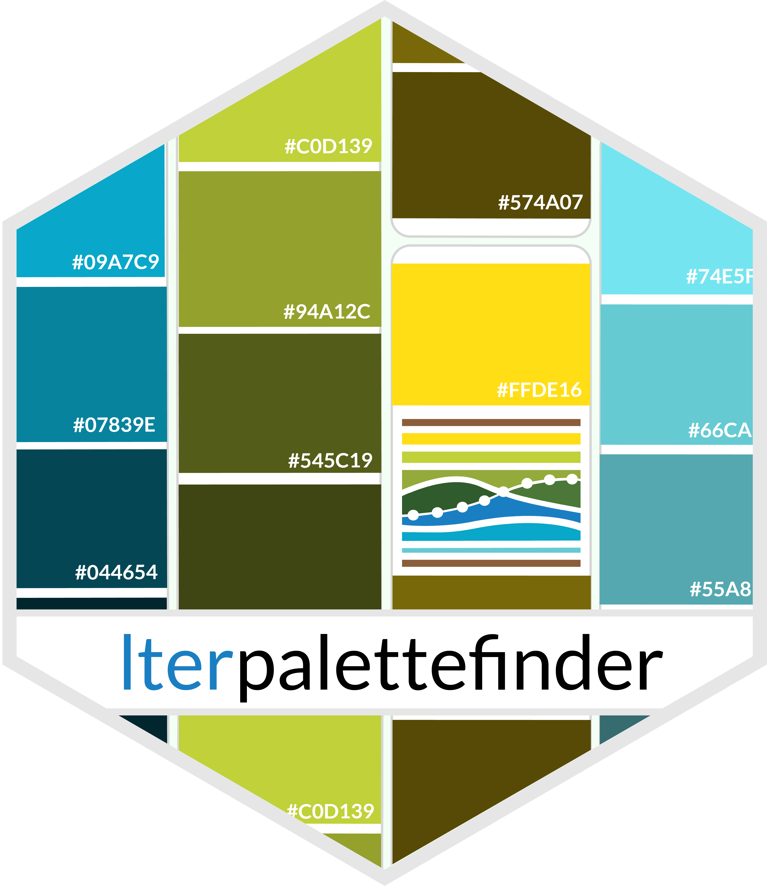
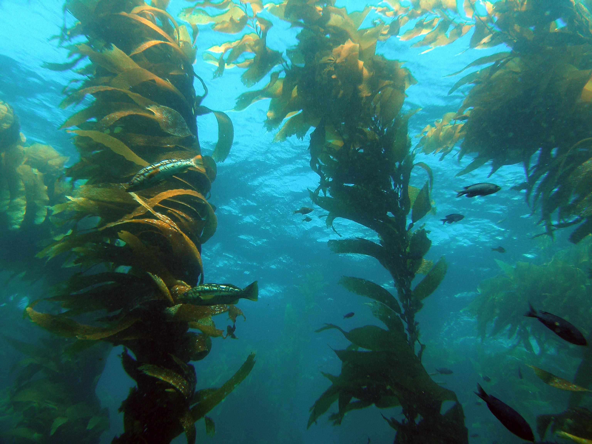
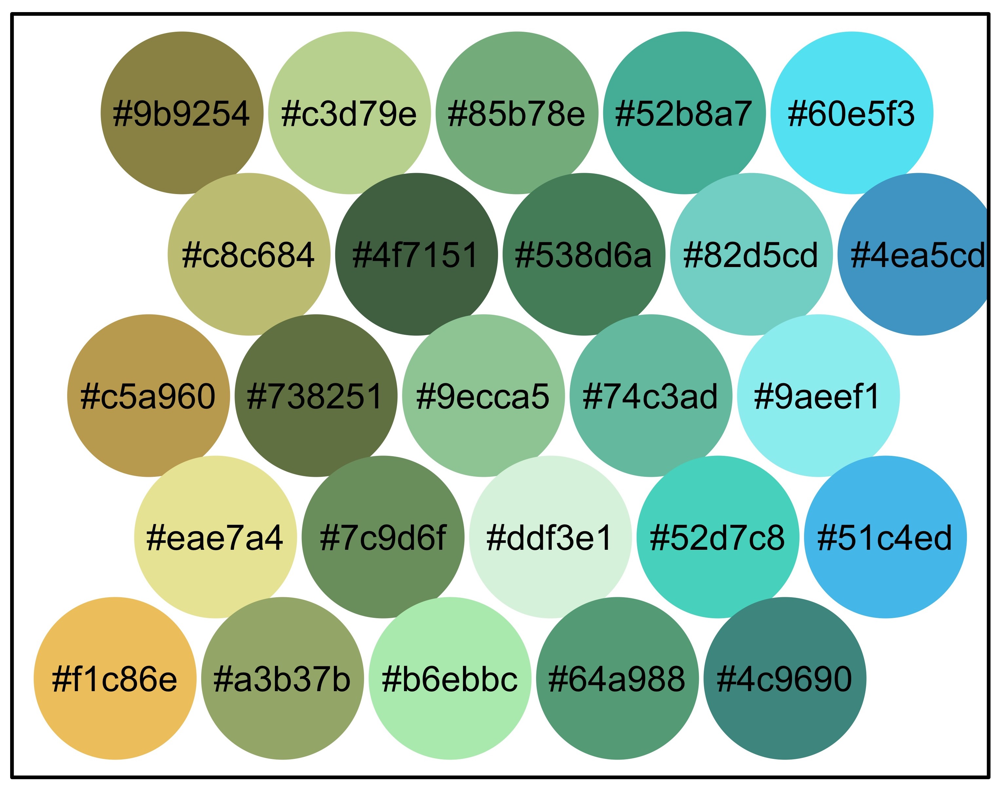
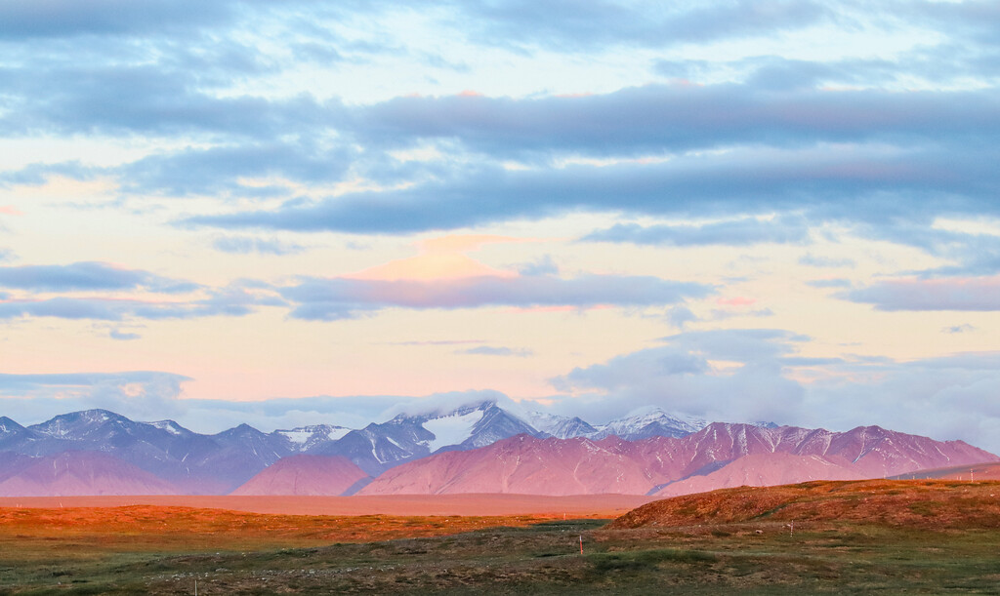
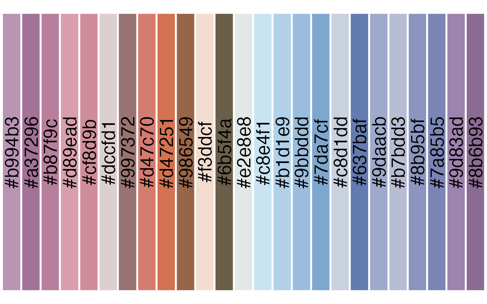
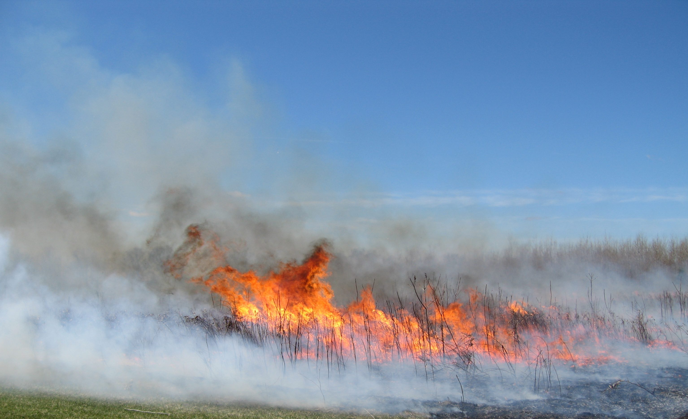
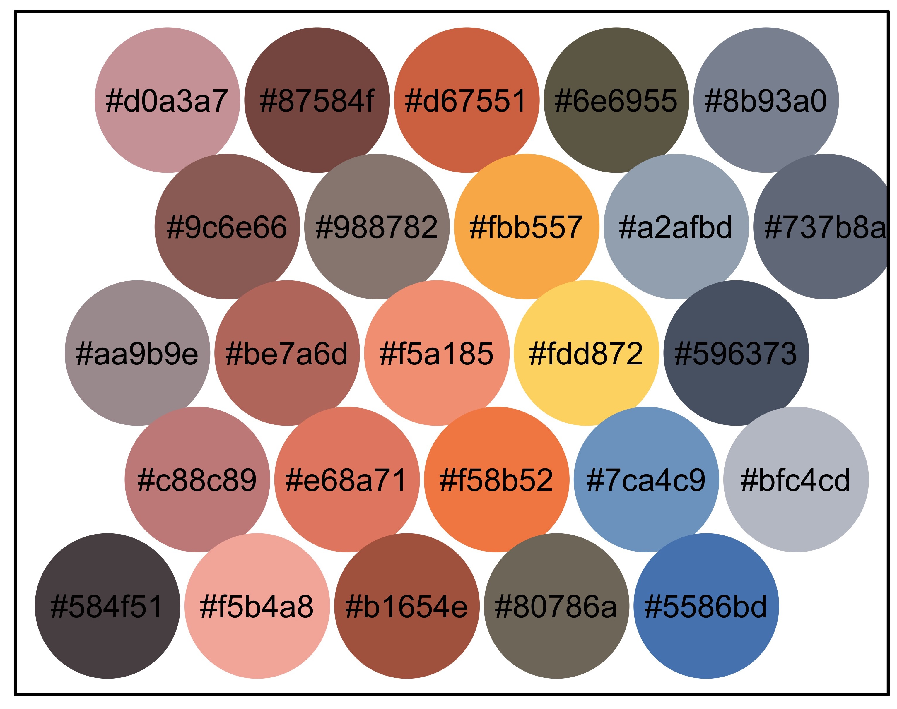

# `lterpalettefinder` - Extract Color Palettes from Photos and Pick Official LTER Palettes



[](https://github.com/lter/lterpalettefinder/actions)
[](https://cran.r-project.org/package=lterpalettefinder)

The goal of `lterpalettefinder` is to provide high quality color
palettes derived from photos at Long Term Ecological Research (LTER)
sites. This allows users to create beautiful graphics that have close
visual ties to photos from the places where data were collected. This
package also allows users to generate their own palettes from any photo
(PNG, JPEG, TIFF, or HEIC) if the current palettes in the function do
not meet their needs. For more information on the LTER Network, check
out [our website](https://lternet.edu/)!

## Installation

You can install the development version of `lterpalettefinder` from
[GitHub](https://github.com/) with:

``` r

# install.packages("pak")
pak::pak("lter/lterpalettefinder")
```

## R Shiny App

To help demonstrate some of the functionalities of `lterpalettefinder`
we have created a [standalone R Shiny
app](https://cosima.nceas.ucsb.edu/lterpalettefinder-shiny/) that allows
for extracting a palette and demonstrating it entirely through a
browser. While we developed this app primarily to support non-R users
interested in `lterpalettefinder` we hope it is interesting and valuable
to R experts as well! The GitHub repo for the Shiny app can be found
[here](https://github.com/lter/lterpalettefinder-shiny).

## Palette Examples

These palette examples were generated from photos at LTER sites.

### [Santa Barbara Coastal LTER](https://sbclter.msi.ucsb.edu/) + `palette_demo`

| **Image** | **Palette** |
|:--:|:--:|
|  |  |

### [Arctic LTER](https://arc-lter.ecosystems.mbl.edu/) + `palette_ggdemo`

| **Image** | **Palette** |
|:--:|:--:|
|  |  |

### [Kellogg Biological Station LTER](https://lter.kbs.msu.edu/) + `palette_demo`

| **Image** | **Palette** |
|:--:|:--:|
|  |  |
